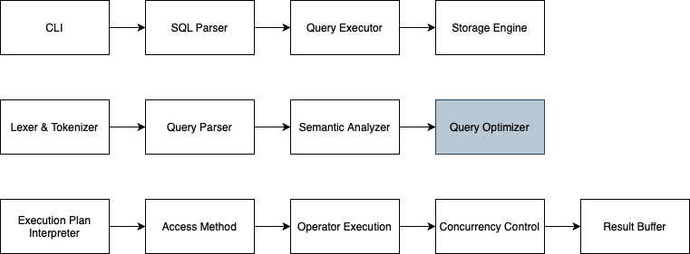

# DBEngine

## Overview
This project is a prototype of a lightweight MySQL-like database engine built using Golang. It is designed to demonstrate fundamental database concepts such as query parsing, indexing, transaction management, and data storage. This project is a learning-oriented prototype of database engine, like MySQL but simplified to focus on core functionalities. The goal is to gain hands-on experience in database architecture, storage management, query processing, and transaction handling.

## Features
✅ **Storage Engine** (Basic file-based row storage)

✅ **SQL Query Processing** (`SELECT`, `INSERT`, `UPDATE`, `DELETE`)

✅ **Indexing** (B+ Tree for primary keys)

✅ **Query Execution** (Sequential scan + index lookup)

✅ **Transaction Support** (ACID, Write-Ahead Logging)

✅ **Simple CLI for Running Queries**

### Out of Scope

❌ **Joins & Complex Queries** (Only simple queries for now)

❌ **Advanced Query Optimizations** (No cost-based optimizer)

❌ **Replication & Sharding** (Single-node only)

❌ **User Management & Security** (No authentication)

## Installation

### Prerequisites

Ensure you have Go installed on your system. You can download it from Go's official website.

**Clone the Repository**
```
git clone https://github.com/yourusername/mysql-like-db.git
cd dbengine
```

**Build and Run**

```
go build -o mysqllite
./dbengine
```

## Usage

### Start the Database Engine

Run the executable:
```
./mysqllite
```

### Execute SQL Queries

Once running, you can interact with the database using SQL-like commands.

****Creating a Table
```
CREATE TABLE users (
id INT PRIMARY KEY,
name TEXT,
email TEXT UNIQUE
);
```

**Inserting Data**
```
INSERT INTO users (id, name, email) VALUES (1, 'John Doe', 'john@example.com');
```

**Querying Data**
```
SELECT * FROM users;
```

**Updating Data**

```
UPDATE users SET name = 'Jane Doe' WHERE id = 1;
```

**Deleting Data**

```
DELETE FROM users WHERE id = 1;
```

## Architecture



### User Interface (CLI/API)

**Main Components:**

- **Command Line Interface (CLI)** → Menerima query dari user.
- **Query Input Handler** → Mengirimkan query ke Lexer.

### SQL Parser

1. **Lexing & Parsing**
- **Lexer** → Memecah query menjadi token.
- **Tokenizer** → Mengelompokkan token berdasarkan jenisnya (keyword, identifier, operator).
- **Query Parser** → Menganalisis token dan membentuk struktur sintaks.
2. **Query Optimization**
- **Query Rewriter** → Menyederhanakan query jika memungkinkan.
- **Execution Plan Generator** → Menentukan cara terbaik untuk mengeksekusi query.
- **Cost Estimator (Basic)** → Menilai performa berbagai cara eksekusi query.

**Query Executor**

- **Query Executor** → Mengeksekusi query berdasarkan execution plan.
- **Result Formatter** → Mengubah hasil query menjadi format yang bisa ditampilkan di CLI.

**Storage Engine**

1. **Data Management**
- **Table Manager** → Mengatur metadata tabel.
- **Row & Column Storage** → Menyimpan data dalam format row-based atau column-based.
2. Indexing System
- **B-Tree / Hash Index** → Mempercepat pencarian data.
3. **Transaction & Concurrency**
- **Write-Ahead Logging (WAL)** → Menyimpan log sebelum menulis ke disk.
- **Locking Mechanism** → Mengelola transaksi paralel.
4. **Data Persistence**
- **File Storage System (Basic)** → Menyimpan data di file teks atau binary.
- **Buffer Pool** → Cache untuk menghindari akses langsung ke disk.

## Contributing

Contributions are welcome! Feel free to submit issues or pull requests.

## License

This project is licensed under the MIT License.